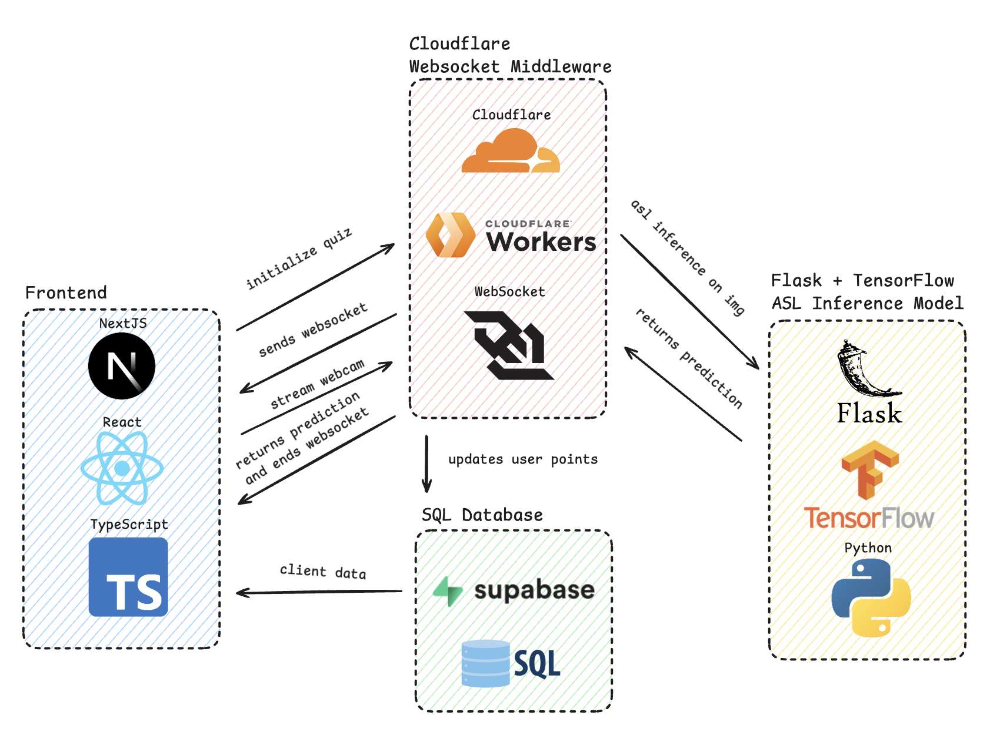
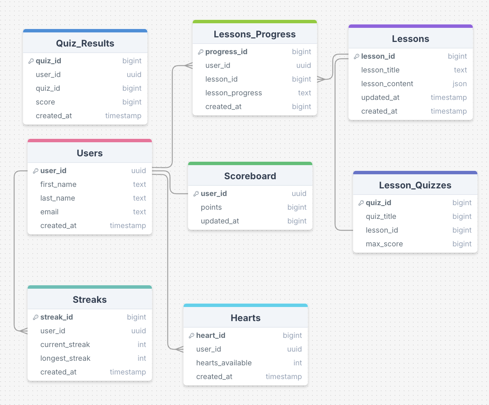
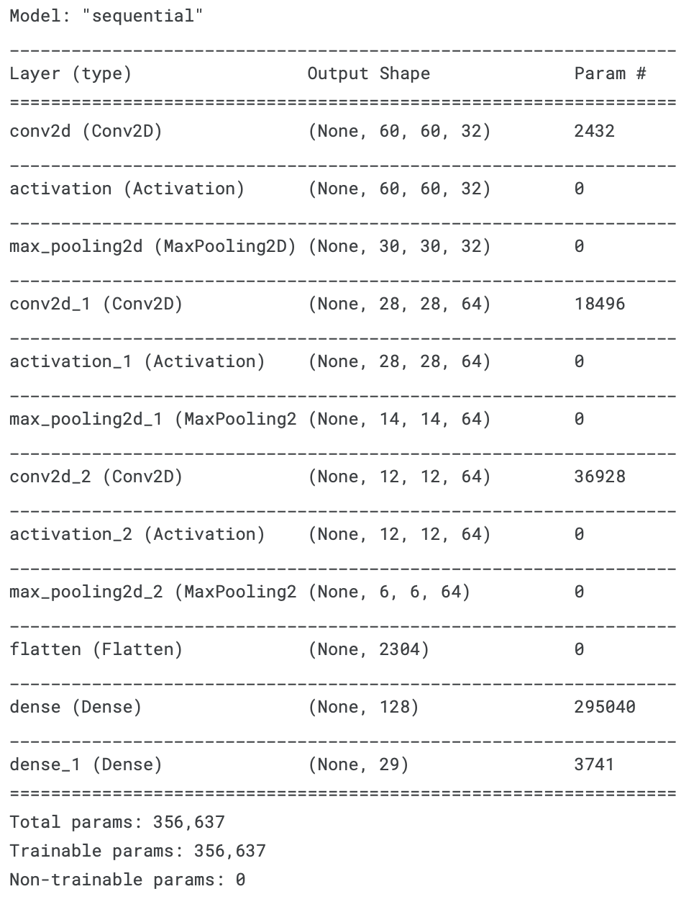
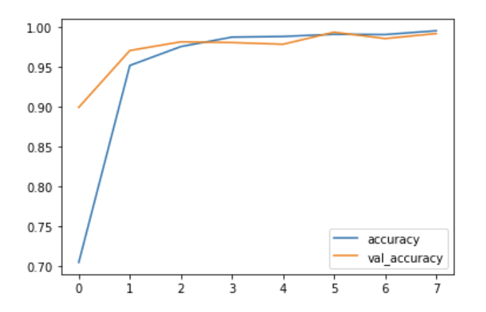

# Signlingo

## Table of Contents

1. [Project Overview](#project-overview)
2. [Features](#features)
3. [Technologies Used](#technologies-used)
4. [Installation](#installation)
   - [Prerequisites](#prerequisites)
   - [Steps](#steps)
5. [Images](#images)

## Project Overview

Signlingo is a web app that gamifies the process of learning American Sign Language (ASL). Inspired by the need for accessible, engaging language-learning tools for the Deaf and hard-of-hearing communities, Signlingo provides bite-sized lessons, real-time gesture recognition, and progress tracking. The app allows users to practice ASL in a fun and interactive way, with personalized learning paths that adapt to the user's skill level.

## Features

- **Bite-sized Lessons**: Learn ASL vocabulary through quick, manageable lessons.
- **Real-Time Gesture Recognition**: AI-powered feedback on your ASL gestures.
- **Progress Tracking (WIP)**: Monitor your progress with streaks, hearts, and a detailed progress tracker.
- **Quizzes**: Test your ASL knowledge with fun quizzes and challenges.
- **Leaderboard**: Compete with others and track your performance.

## Technologies Used

- **Frontend**: Next.js, React.js, TypeScript, Tailwind CSS
- **Backend**: Flask (API), Supabase (Authentication & Database)
- **AI/ML**: TensorFlow, Python (for ASL gesture recognition)
- **Other**: WebSockets (for real-time video streaming)

## Installation

To get a local copy up and running, follow these steps:

### Prerequisites

- Node.js
- Python 3.x
- Supabase account for authentication and database setup

### Steps

1. **Clone the repository:**
   ```bash
   git clone
   cd signlingo
   ```
2. **Install dependencies**
   ```bash
   npm install
   ```
   ```bash
   cd ml
   python3 -m venv venv (Windows)
   source venv/bin/activate (Linux/MacOS)
   pip install -r requirements.txt
   ```
3. **Setup Supabase**
   Create a Supabase project and configure your API keys and database.
   Add the Supabase keys to your environment variables.

4. **Run the project**
   ```bash
   npm run dev
   cd ml
   python app.py
   ```

## Images





